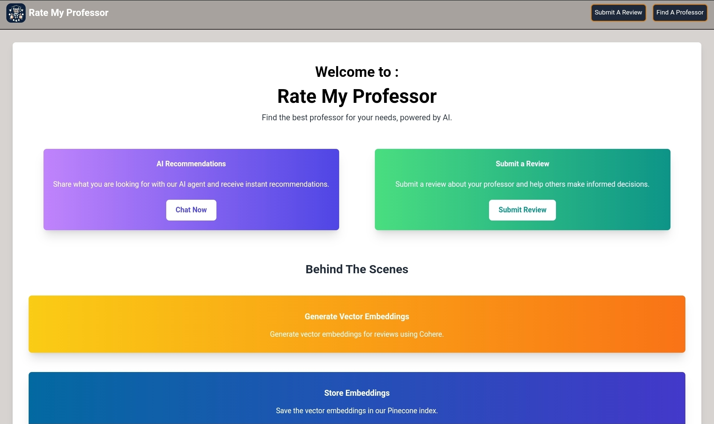
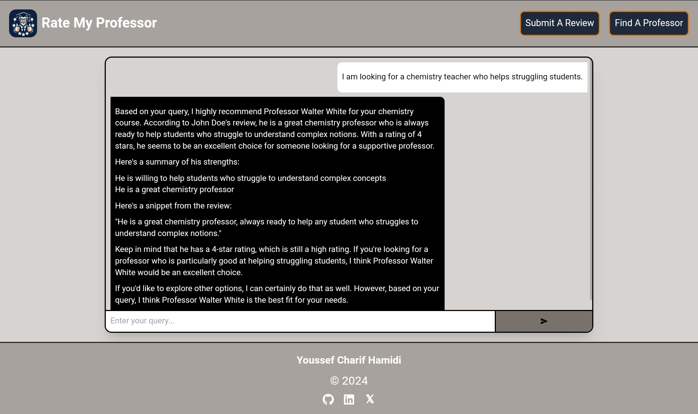
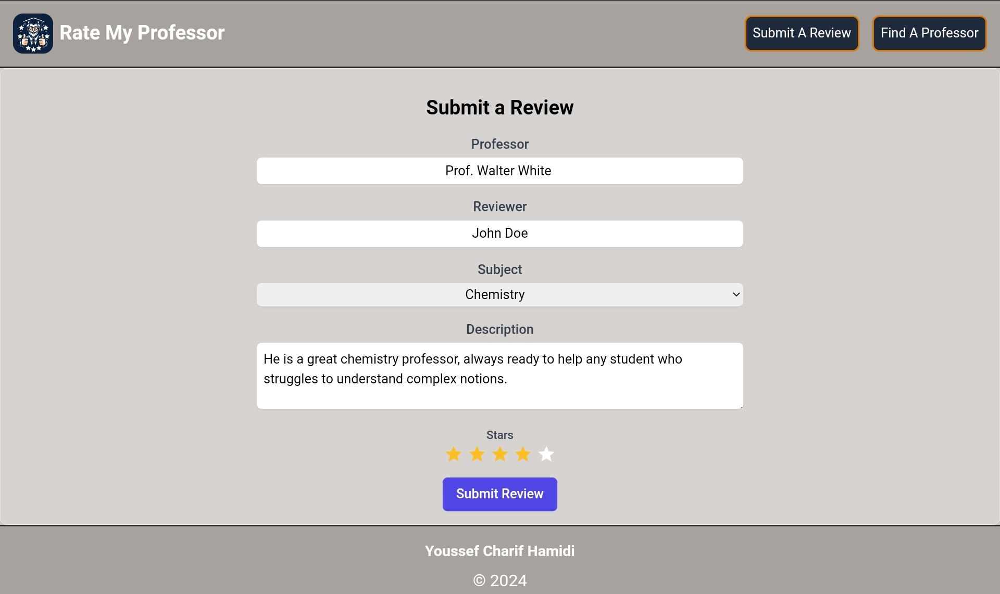

# Rate My Professor

## Introduction

Welcome to **Rate My Professor**, the AI-powered platform that helps you find the best professor for your needs. Whether you're seeking personalized recommendations or want to submit a review to help others, our platform is designed to assist with both. Powered by cutting-edge AI technologies, Rate My Professor simplifies the search for the right professor who fits your learning style.

## Features

- **AI Recommendations**: Share your preferences with our AI agent and receive personalized professor recommendations instantly.

- **Submit a Review**: Submit detailed reviews of your professors and contribute to helping other students make informed choices.

## AI Technologies

- **Cohere**: We use Cohere to generate vector embeddings from professor reviews, turning text data into numerical representations that can be easily analyzed and compared.
- **Pinecone**: Pinecone serves as our vector database, storing embeddings and enabling quick retrieval of the best matches based on user queries, ensuring relevant and accurate recommendations.
- **Groq API**: Our conversational AI capabilities are powered by Groq API, which leverages contextual data to engage users in meaningful and insightful conversations, providing recommendations and answering queries based on a deep understanding of the user's needs.

## Tech Stack

- **Next.js**: Our web application is built using Next.js, ensuring fast and efficient rendering and smooth routing.
- **Tailwind CSS**: Tailwind CSS is used for crafting responsive and beautiful UI components, giving the app a modern and clean design.

## Thanks

Thank you for exploring Rate My Professor! We hope this platform helps you find the right professor while fostering a collaborative and informed community.
